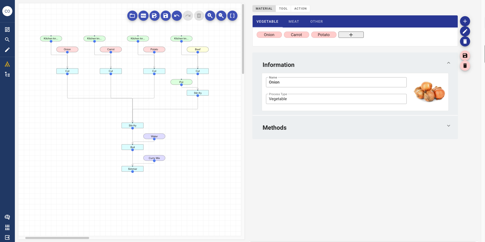

# Labmine-Front
Labmine is an electronic lab notebook focusing on process.
It can be used for research, manufacture, cooking, hobbies, etc.

※This repository is only the source code of Labmine's frontend.
Please use it together with <a href="https://github.com/kumagallium/labmine-api">Labmine api</a> repository.
## Demo 
https://demo-labmine.c1.hacobuneapp.com/

## How to use
### ●Build & run on local computer
If you want to run it on a local computer, use the <a href="https://github.com/kumagallium/labmine-dev">labmine-dev</a> repository and start it with docker-copomse.

### ●Build & run on Cloud
Under construction

## Contributing
1. Fork it (`git clone https://github.com/kumagallium/labmine-front.git`)
2. Create your feature branch (`git checkout -b your-new-feature`)
3. Commit your changes (`git commit -am 'feat: add some feature'`)
4. Push to the branch (`git push origin your-new-feature`)
5. Create a new Pull Request

## License
Labmine is developed and maintained by Masaya Kumagai, under [BSD 2-Clause "Simplified" License](LICENSE.txt).